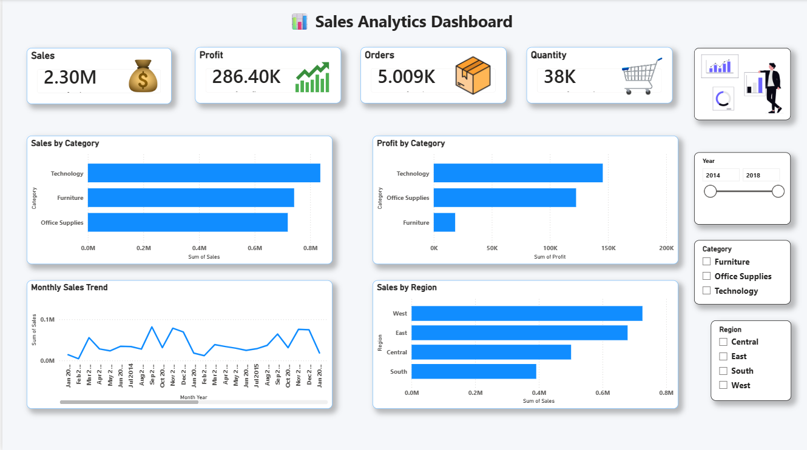

# 📊 Sales Analytics Dashboard

A Data Analytics project developed using **SQL, Python, SQLite, Excel, and Power BI** to analyze retail sales data and create an interactive business dashboard.

- ## 📸 Dashboard Preview



---

# 🚀 Project Overview

This project demonstrates the complete data analytics workflow:

- Data Cleaning
- Data Analysis
- SQL Queries
- Python Analysis
- Interactive Power BI Dashboard
- Business Insights

---

# 🛠️ Tools & Technologies

- Microsoft Excel
- SQL
- SQLite
- Python
- Pandas
- Power BI Desktop

---

# 📂 Project Structure

```
Sales-Analytics-Project
│
├── Dashboard_Images
├── Database
├── Dataset
├── PowerBI
├── Python
├── Sql
└── README.md
```

---

# 📈 Dashboard Features

- Total Sales KPI
- Total Profit KPI
- Total Orders KPI
- Total Quantity KPI
- Sales by Category
- Profit by Category
- Monthly Sales Trend
- Sales by Region
- Interactive Filters (Slicers)

---

# 🔍 Key Insights

- Identified top-performing product categories.
- Compared regional sales performance.
- Analyzed monthly sales trends.
- Measured profit contribution by category.

---

# 👨‍💻 Author

**Nikhil Kumar**

Aspiring Data Analyst

Skills:
- SQL
- Python
- Excel
- Power BI
